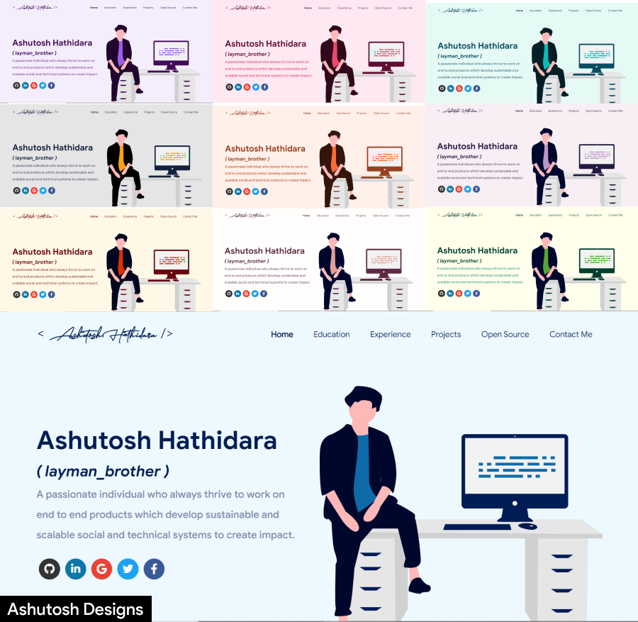

<h1 align="center"> My Portfolio 🔥 </h1> 

  
  
  
  
  
  
   
  
  
  
  
  
  
  

 
    <a href="https://dinesh-kumar.info/" target="_blank">
    </img>
  </a>

# Sections 📚

✔️ Summary and About me\
✔️ Skills \
✔️ Experience\
✔️ Certifications 🏆\
✔️ Education\
✔️ Contact me

To view a live example, **[click here](https://dinesh-kumar.info/)**

# Technologies used 🛠️

- [React](https://reactjs.org/)
- [graphql](https://graphql.org/)
- [apollo-boost](https://www.apollographql.com/docs/react/get-started/)
- [baseui](https://github.com/uber/baseweb)
- [react-reveal](https://www.react-reveal.com/)
- [styled-components](https://styled-components.com/)

# License 📄

This project is licensed under the MIT License - see the [LICENSE.md](./LICENSE) file for details.

